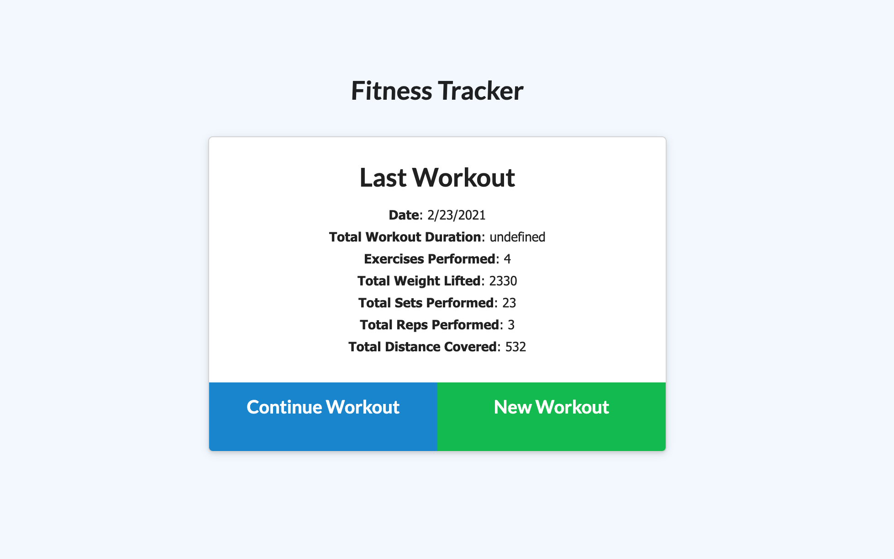
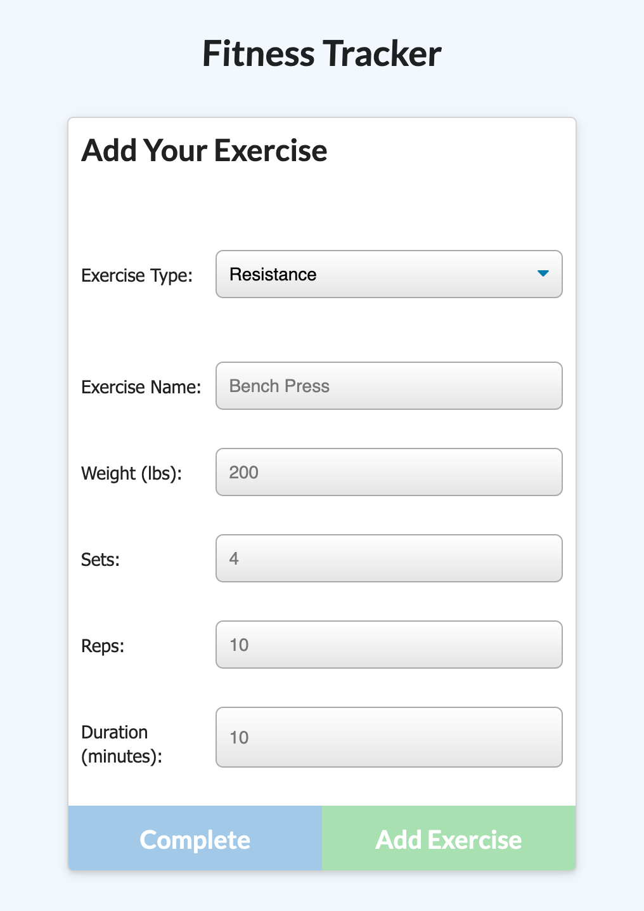
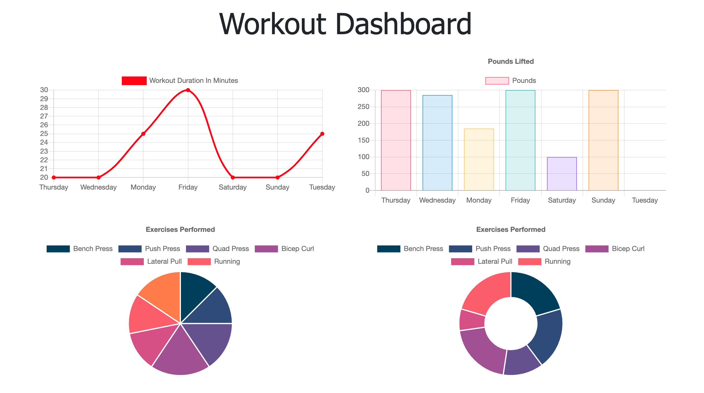

# Fitness Tracker    
  

  ## Table of Contents  
  1. [Description](#description) 
  2. [Installation](#installation) 
  3. [Usage](#usage)
  4. [Licensing](#licensing)
  5. [Challenges](#challenges)
  6. [Screenshots](#screenshots)
  7. [Additional Questions](#additional-questions?)

  ---  

  ## Description:  
  For this project, we were tasked with building out the database and server for a fitness tracking app. The app's database was built using MongoDB with the Mongoose.js library. The server was built using Express.js.  

  ---  

  ## Installation:  
  You can access the app at https://infinite-thicket-13779.herokuapp.com/  

  ---  

  ## Usage:  
  When you access the app, you'll be presented with information on your most recent workout and with options to continue the workout or create a new workout. For either option, you'll be presented with a form to add indiviual exercises. You can specify if the type of exercise is cardio or resistance and then add additional information about the exercise. To see stats from the previous 7 workouts, click Dashboard in the upper lefthand corner.  

  --- 

  ## Licensing:  
  Public Domain - App can be shared and modified however you want!

  ---  

  ## Challenges:  
  This homework presented many challenges. The first was trying to understand the functionality that the app was trying to achieve, and then traslate that into the routes in the server and the database models. The most challenging part of this was getting the total duration for the workout. I struggled a lot to understand how to use the aggregate method to get the total workout duration based on the durations of each invidivual exercise under the workout.

  ---

  ## Screenshots:
  

  

  

  ---  
  ## Additional Questions?  
  If you have any other questions, you can contact the project creator at:  
  GitHub username: rhubble1987  
  Email address: rhubble1987@gmail.com
